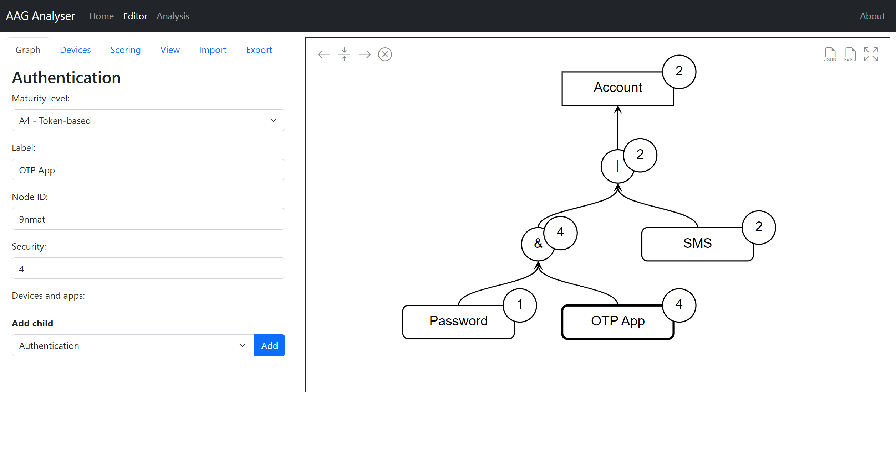

# Account Access Graph (AAG) Analyser

## Description
The AAG Analyser is a client-based web tool that allows to create AAG models and to analyse them. The tool currently supports the derivation of security and accessibility scores. AAG models can be exported as JSON files to be used and edited afterwards. Furthermore, the visual representation of a graph can be downloaded as SVG file. 

## Dependencies
The following 3rd party libraries are used in this application. Please refer to the links for license information.
- d3.js (https://d3js.org)
- jQuery v3.6.0 (https://jquery.com)
- Bootstrap v5.2 (https://getbootstrap.com)

## Requirements
The tool is a purely client-based application composed of HTML, JavaScript and CSS and does thus only require a browser to be used.

## Example
The following screenshot shows how the AAG Analyser Editor front-end looks like:

# License
MIT

